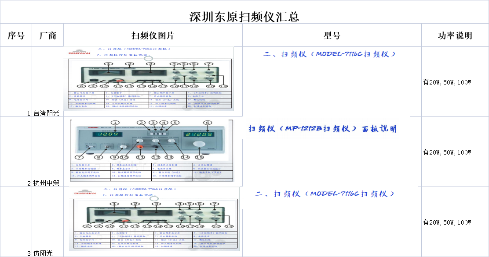

# Sweep Generator / 扫频仪

基于声卡和 LabVIEW 开发的扫频信号发生器项目，目标是用于替代产线上的低端扫频仪。项目支持扫频参数设置、波形生成、音频输出、外部音频导入、信号保存与输出电压校准，适合用于扬声器、声学器件或产线测试场景。

## 主要功能

- 设置起始频率、终止频率、输出幅值、信号时长、重复次数和扫频模式。
- 生成扫频 / chirp 信号，并支持波形预览。
- 通过声卡或 ASIO 音频接口输出测试信号。
- 支持外部音频信号导入，以及扫频信号导出为文本数据。
- 提供输出电压校准流程，校准数据保存在 `cal.dat`、`cal2.dat` 等文件中。
- 项目内置若干 `signal/` 示例信号文件，文件名记录了频率、幅值和时长参数。

## 项目结构

```text
.
├── 扫频仪.lvproj                         # LabVIEW 项目文件
├── VIs/
│   ├── main.vi                           # 主程序入口
│   ├── Generate Sound_chirp.vi           # 扫频 / chirp 信号生成
│   ├── asio_out_in.vi                    # ASIO 输入输出联调
│   ├── calibration.vi                    # 输出电压校准
│   ├── save_wav_as_txt.vi                # 保存波形文本
│   └── read_wav_from_txt.vi              # 读取波形文本
├── waveio_108/                           # WaveIO / ASIO 支持库
├── signal/                               # 示例或导出的扫频信号文本
├── main.dat                              # 主程序参数数据
├── cal.dat / cal2.dat                    # 校准数据
└── 20250325关于基于声卡和labview的开发定位 wq.docx
```

## 运行环境

- Windows
- LabVIEW 2021 或兼容版本
- 可用的声卡 / 外置音频接口及对应驱动
- ASIO 输出时需要 `waveio_108/` 中的 WaveIO 组件
- 如果打开项目时提示缺少 `SoundVib_Generation.lvlib`，请安装 NI Sound and Vibration 相关组件或在 LabVIEW 中重新链接等效依赖

## 快速开始

1. 使用 LabVIEW 打开 `扫频仪.lvproj`。
2. 在项目浏览器中打开并运行 `VIs/main.vi`。
3. 设置起始频率、终止频率、信号幅值、信号时长、重复次数和扫频模式。
4. 选择声卡或 ASIO 输出链路，确认输出设备和音量设置。
5. 首次接入新声卡、功放或负载前，先运行校准流程并保存校准数据。
6. 需要复用信号时，可从 `signal/` 读取已有文本文件，或将新生成的信号导出保存。

## 构建 EXE

项目已包含 LabVIEW 构建规格：

- 构建规格：`扫频仪20250703`
- 主入口：`VIs/main.vi`
- 输出程序名：`扫频仪20250703.exe`

在 LabVIEW 项目浏览器中展开 `Build Specifications`，右键 `扫频仪20250703`，选择 `Build` 即可生成 Windows 可执行文件。

## 数据文件说明

- `main.dat`：保存主界面参数，如起始频率、终止频率、信号幅值、信号时长、重复次数和扫频模式。
- `cal.dat`、`cal2.dat`：保存输出电压校准参数。
- `signal/*.txt`：扫频信号文本文件，常见命名格式为 `起始频率-终止频率-幅值-时长.txt`，例如 `80-3000-1.00V-1.00s.txt`。

## 参考资料

项目根目录中的 `20250325关于基于声卡和labview的开发定位 wq.docx` 记录了开发定位和主要指标；`微信图片_20250325091931.png` 是产线扫频仪硬件参考资料。



## 注意事项

- 进行产线测试前，请先用示波器、万用表或标准负载验证实际输出电压，避免声卡、功放或负载差异导致输出偏差。
- `waveio_108/` 中的 DLL 和 LLB 文件需要与项目保持相对路径，移动项目时请保持目录结构不变。
- LabVIEW 的二进制 VI 文件不便于文本 diff，修改前建议先记录功能点和测试参数。
